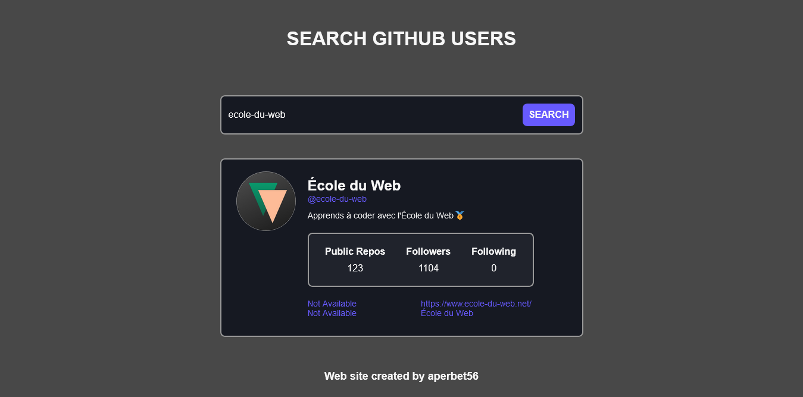

## GITHUB API USERS

## Le challenge

Mon objectif a été de construire un site web permettant de récupérer et d'afficher les données des utilisateurs de Github. Pour se faire :

- j'ai utilisé l' API Github.
- l'internaute doit renseigner un nom d'utilisateur, cliquer sur le bouton "search" et les informations vont apparaître.
- le site web est reponsive.

## Démonstration

Lien vers le projet : https://aperbet56.github.io/github_api_users/

## Projet développé avec

- Utilisation des balises sémantiques HTML5
- CSS
- Flexbox
- Animation CSS au survol de la souris sur le bouton "Search"
- Animation CSS au survol de la souris sur le champ de formulaire et sur le résultat
- Page web responsive
- JavaScript (fetch, fonction asynchrone, fonction fléchée, écouteur d'événement...)
- Code JavaScript commenté
- Github API
- Desktop first
